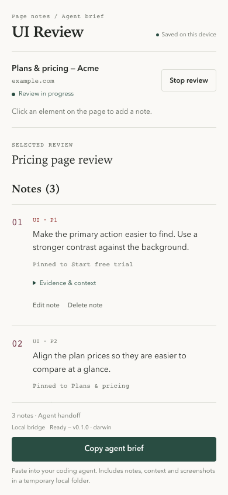
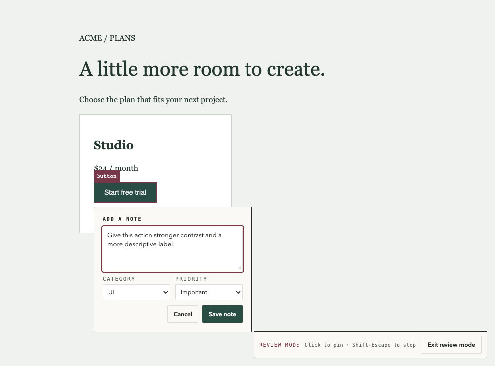
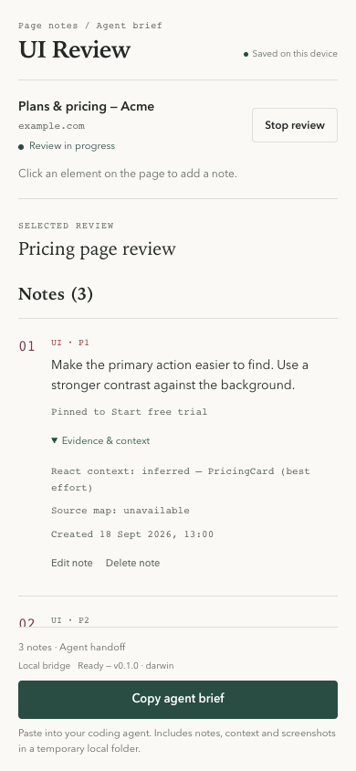

# UI Review

> **See the flaw. Give the fix.**

UI Review is a local-first Chrome extension for turning feedback on a real web page into a clear brief for your coding agent.

Point at the element. Add the note. Keep the proof. Hand over the work.

<p align="center">
  
  &nbsp;&nbsp;
  
</p>

## Why UI Review?

Most UI feedback gets diluted between a screenshot, a vague ticket and a conversation.
UI Review keeps the original context attached to the request, so the person — or agent — making the change knows exactly what to act on.

- **Review in place** — hover, click and write directly on the page.
- **Keep evidence** — each note can retain an element reference, screenshots and technical context.
- **Stay in control** — pause a review to use the page normally, then resume it from the original URL.
- **Hand it off clearly** — copy a structured local brief with the notes and their evidence.

## The flow

1. Open the side panel and start a review on any HTTP(S) page.
2. Click the elements that need attention and write a concise note.
3. Review the evidence, then copy the agent brief when it is ready.

<p align="center">
  
</p>

## Install locally

UI Review is currently distributed from source.

```sh
npm install
npm run build
```

Then open `chrome://extensions`, enable **Developer mode**, choose **Load unpacked**, and select the generated `dist/` folder. Click the extension icon to open the side panel.

> To use **Copy agent brief**, install the local companion bridge too. Its setup instructions are in the [local bridge guide](#local-bridge).

## Local-first, with honest context

Reviews, screenshots and exported handoff files remain on your machine. DOM evidence excludes
form values and redacts known secret-like values. Screenshots reflect the visible page, remain
local, and can be reviewed or removed before handoff.

When a saved note contains a published framework reference, UI Review may request that page’s public JavaScript source map to provide better context. Fetched source is discarded: it is not stored or exported.

## Local bridge

The optional companion bridge lets Chrome materialize the brief and its screenshots as local files for your coding agent. It supports macOS Apple Silicon and Windows x64.

For development, after building the extension:

```sh
npm run bridge:install
```

For standalone bridge packages and platform-specific installation instructions, see the [bridge documentation](docs/architecture.md).

## Product showcase

The visual showcase used for this repository is available in [the project’s `docs/` page](docs/index.html). It includes desktop and mobile captures of the product flow.

## Documentation

- [Architecture](docs/architecture.md)
- [Design direction and UI evidence](docs/design/DESIGN.md)
- [Security and privacy model](docs/architecture.md)

## Development

Requires Node.js 20.19 or newer.

```sh
npm install
npm run verify
```

`verify` runs linting, type checks, tests and production builds.
